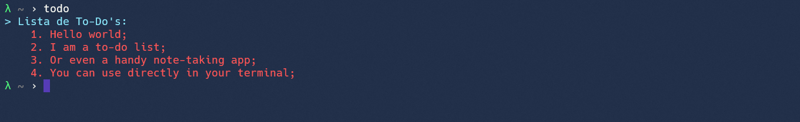

# Info

Terminal to-do list made in bash. I'm no expert in bash scripting so feel free to send me any feedack.

## Instalation

To install the script, just run

```
sudo ./install.sh
```

it needs sudo permition so it can copy files to your usr/local/bin folder.


